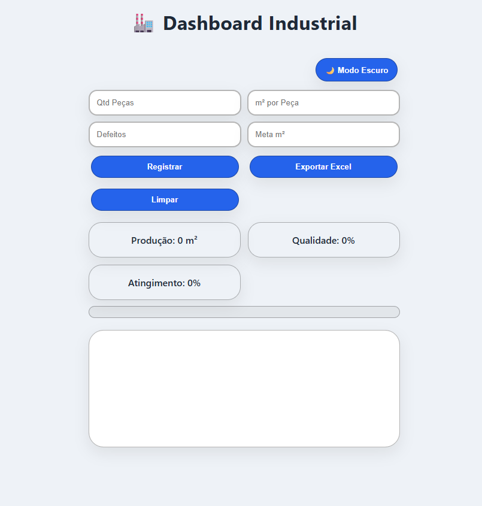
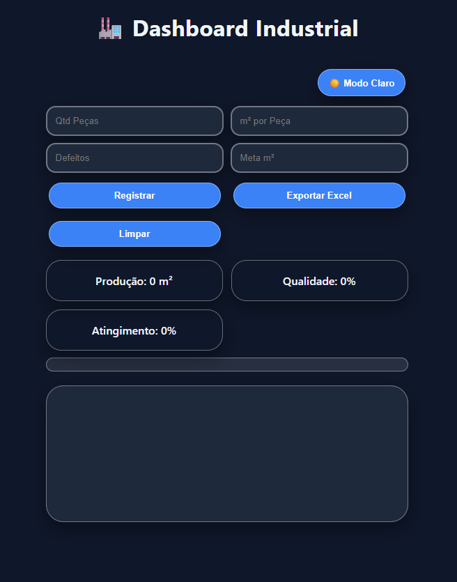
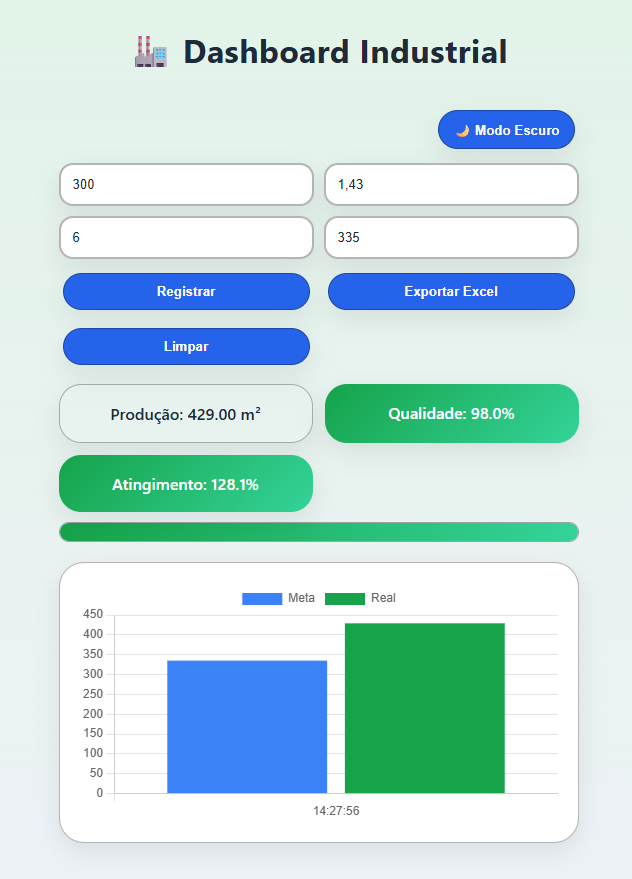

# 🏭 Dashboard Industrial Realtime

Sistema profissional de monitoramento de produção industrial com atualização 100% em tempo real usando Firebase + Firestore.

---

## 📸 Preview do Sistema

### 🌞 Modo Claro

---

### 🌙 Modo Escuro

---

### 📊 Gráfico Meta vs Real

---

### 📺 Versão TV da Fábrica (Widescreen)

---

## 🚀 Funcionalidades

- 📊 Cálculo automático de produção (m²)
- 🎯 Atingimento de meta em %
- ✅ Cálculo de qualidade (%)
- 📈 Gráfico Meta vs Real
- 🔄 Atualização em tempo real (Firestore)
- 📁 Exportação para Excel
- 🌙 Modo claro/escuro
- 📺 Layout para TV industrial
- 🏭 Visual estilo Indústria 4.0

---

## 🧠 Tecnologias Utilizadas

- HTML5
- CSS3
- JavaScript ES6
- Chart.js
- Firebase 12+
- Firestore
- XLSX.js

---
